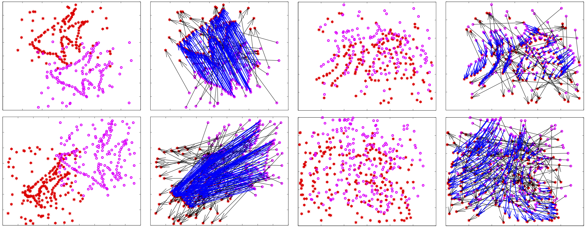

## Learning Coherent Vector Fields for Robust Point Matching under Manifold Regularization
 
Author:      Gang Wang

Email:    gwang.cv@gmail.com

---

For more information, please refer to:

Gang Wang et al., **Learning Coherent Vector Fields for Robust Point Matching under Manifold Regularization**. Neurocomputing, 2016, Vol 216, pp. 393-401

#### MRCVF

We propose a robust method for coherent vector field learning with outliers (mismatches) using manifold regularization, called manifold regularized coherent vector field (**MRCVF**). The method could remove outliers from inliers (correct matches) and learn coherent vector fields fitting for the inliers with graph Laplacian constraint.

#### License

MIT